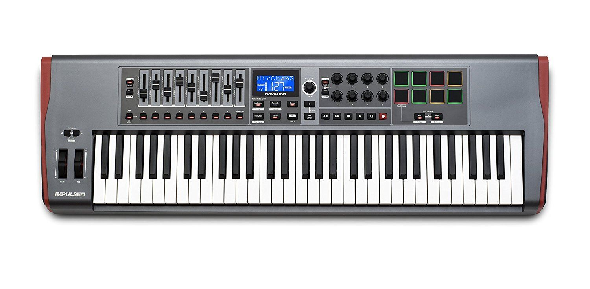
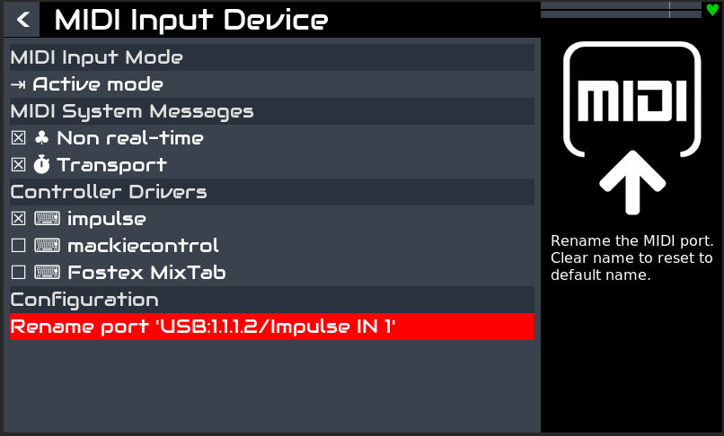
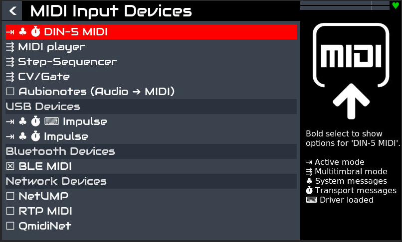
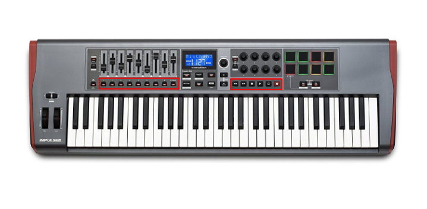
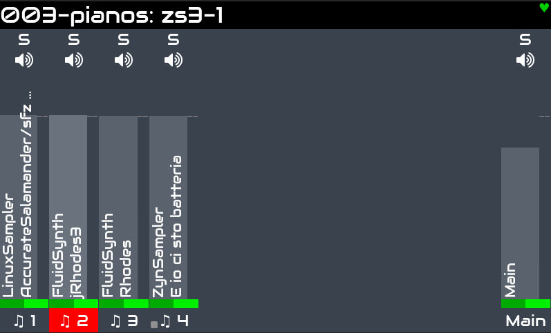

# Impulse

My attempt to develop a Zynthian [ctrldev](https://wiki.zynthian.org/index.php/Ctrldev) for the [Novation Impulse 61](https://novationmusic.com/impulse)

[Claude](https://claude.ai/new) by anthropic helped a lot 



The code is located in the folder **/zynthian/zynthian-ui/zyngine/ctrldev** of your Zynthian. 
You can access it via SSH on zynthian.local

Assuming you name your ctrldev **zynthian_ctrldev_impulse**, you have to store it in the file **zynthian_ctrldev_impulse.py**
under **/zynthian/zynthian-ui/zyngine/ctrldev**

```

aconnect -i 
amidi -l

```

Should give you the id to be used in the **dev_ids**  in the following code, but at least in my case, it didn't work.
However, looking at the configuration of the Zynthian (see image below), you get the correct id, namely **Impulse IN 1**



The basic code to intercept midi event from the keyboard is the following: 

**NOTE: unroute_from_chains = False** is necessary to deliver the midi events to the chains.

```python

from zyngine.ctrldev.zynthian_ctrldev_base import zynthian_ctrldev_base
import logging
import subprocess

class zynthian_ctrldev_impulse(zynthian_ctrldev_base):

    # Keep a broad match for debugging
    dev_ids = ['Impulse IN 1', 'Impulse  Impulse ', 'Impulse  Impulse MIDI In ']

	# True if input device must be unrouted from chains when driver is loaded
	# see zynthian_ctrldev_base.py
    unroute_from_chains = False

    def __init__(self, state_manager, idev_in, idev_out=None):
        super().__init__(state_manager, idev_in, idev_out)
        logging.warning("Impulse controller __init__ called")

    def midi_event(self, ev):
        """Logs all MIDI events"""
        logging.warning(f"Impulse MIDI event: {ev}")
        if ev[0] == "cc":
            cc = ev[2]
            val = ev[3]
            logging.warning(f"Impulse CC {cc} -> {val}")
        if ev[0] == "note_on":
            note = ev[2]
            vel = ev[3]
            logging.warning(f"Impulse PAD {note} velocity {vel}")
        if ev[0] == "note_off":
            note = ev[2]
            logging.warning(f"Impulse PAD {note} released")
        return False

```

To check whether the driver has been loaded you have to restart the zynthian service and 
then observe the logs as shown below:

```
systemctl restart zynthian
journalctl -f | grep Impulse
```

Zynthian admin tells you whether the driver is correctly loaded (see the little keyboard icon)



```
(venv) root@zynthian:~# journalctl -f | grep Impulse
Mar 08 17:28:00 zynthian startx[12826]: WARNING:zynthian_ctrldev_impulse.__init__: Impulse controller __init__ called
Mar 08 17:28:08 zynthian startx[12826]: WARNING:zynthian_ctrldev_impulse.midi_event: Impulse MIDI event: b'\x90V\x13'
Mar 08 17:28:08 zynthian startx[12826]: WARNING:zynthian_ctrldev_impulse.midi_event: Impulse MIDI event: b'\x80V\x00'
Mar 08 17:28:09 zynthian startx[12826]: WARNING:zynthian_ctrldev_impulse.midi_event: Impulse MIDI event: b'\x90VD'
Mar 08 17:28:09 zynthian startx[12826]: WARNING:zynthian_ctrldev_impulse.midi_event: Impulse MIDI event: b'\x80V\x00'
Mar 08 17:28:10 zynthian startx[12826]: WARNING:zynthian_ctrldev_impulse.midi_event: Impulse MIDI event: b'\x90M\x1d'
Mar 08 17:28:10 zynthian startx[12826]: WARNING:zynthian_ctrldev_impulse.midi_event: Impulse MIDI event: b'\x80M\x00'
Mar 08 17:28:11 zynthian startx[12826]: WARNING:zynthian_ctrldev_impulse.midi_event: Impulse MIDI event: b"\x90L'"
Mar 08 17:28:11 zynthian startx[12826]: WARNING:zynthian_ctrldev_impulse.midi_event: Impulse MIDI event: b'\x80L\x00'

```

## Change chain e transport

I use the keyboard to practice the songs we play in our group. To this purpose, I need two main features: 

1. Change the chain quickly with the Impulse buttons. Note they **must** send a midi Prog Chg
2. Control the playing of the tracks I use to practice by the play/stop, etc. buttons on the Impulse





The following code is my first implementation of these features.  

```python
import logging

from zyngine.ctrldev.zynthian_ctrldev_base import zynthian_ctrldev_base


class zynthian_ctrldev_impulse(zynthian_ctrldev_base):
    dev_ids = ["Impulse IN 1", "Impulse  Impulse ", "Impulse  Impulse MIDI In "]

    # ADD THIS LINE:
    unroute_from_chains = False

    def __init__(self, state_manager, idev_in, idev_out=None):
        super().__init__(state_manager, idev_in, idev_out)
        logging.warning(f"Impulse controller __init__ called, idev_in={idev_in}")

    def midi_event(self, event):
        """
        By overriding this, you can intercept knobs/sliders.
        To just let notes pass through to the synth,
        return False or call the super method.
        """
        """
        chains = list(self.chain_manager.chains.keys())
        for chain_id in chains:
            chain = self.chain_manager.chains[chain_id]
            logging.warning(
                f"chain_id={chain_id} name='{chain.get_name()}' desc='{chain.get_description()}'"
            )
         """

        # Log to prove it's working
        logging.warning(f"Impulse MIDI: {event}")
        evtype = (event[0] >> 4) & 0x0F

        # This is used to change the progam by the buttons on the keyboard
        if evtype == 0xC:
            pgm = event[1]
            chains = list(self.chain_manager.chains.keys())
            logging.warning(f"Program Change: pgm={pgm}, chains={chains}")
            if pgm < len(chains):
                self.chain_manager.set_active_chain_by_id(chains[pgm])

        # MMC SysEx messages
        #
        if event[0] == 0xF0 and len(event) >= 6 and event[3] == 0x06:
            cmd = event[4]
            # Find ZynSampler chain
            zynsampler_chain = None
            for chain_id in self.chain_manager.chains.keys():
                chain = self.chain_manager.chains[chain_id]
                if "ZynSampler" in chain.get_name():
                    zynsampler_chain = chain
                    break

            # THIS BLOCK WAS INCORRECTLY INDENTED INSIDE THE FOR LOOP
            if zynsampler_chain:
                proc = zynsampler_chain.get_processors()[0]
                transport_ctrl = proc.controllers_dict.get("transport")
                if transport_ctrl:
                    if cmd == 0x01:  # Stop
                        transport_ctrl.set_value("stopped")
                        logging.warning("MMC Stop -> ZynSampler")
                    elif cmd == 0x02:  # Play
                        transport_ctrl.set_value("playing")
                        logging.warning("MMC Play -> ZynSampler")
                    elif cmd == 0x06:  # Record
                        record_ctrl = proc.controllers_dict.get("record")
                        if record_ctrl:
                            record_ctrl.set_value("recording")
                        logging.warning("MMC Rec -> ZynSampler")
            return
        # Return False to tell Zynthian:
        # "I'm not consuming this event, pass it to the synth engine."
        return False
```
